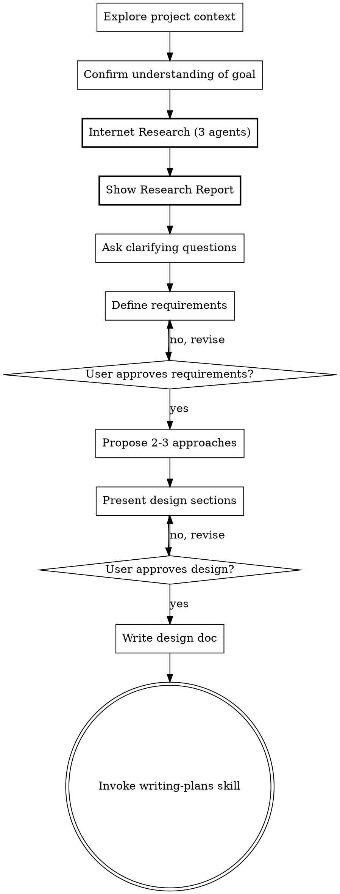

# Brainstorm Research Phase — Implementation Plan

> **For Claude:** REQUIRED SUB-SKILL: Use forge:executing-plans or forge:subagent-driven-development to implement this plan task-by-task.

**Goal:** Добавить мультиагентную research-фазу в скилл forge:brainstorm — 3 параллельных агента ищут аналоги, технические решения и риски перед уточняющими вопросами.

**Architecture:** Новый шаг 2.5 в checklist SKILL.md между "Confirm goal" и "Ask questions". Скилл формулирует поисковые задания, запускает 3 Agent tool параллельно, синтезирует результаты в Research Report, показывает пользователю.

**Tech Stack:** Markdown (SKILL.md prompt engineering), Claude Code Agent tool, WebSearch, Context7 MCP

**Design doc:** `.forge/plans/2026-04-06-brainstorm-research-phase-design.md`

---

### Task 1: Добавить шаг 2.5 "Internet Research" в Checklist

**Files:**
- Modify: `forge-plugin/skills/brainstorming/SKILL.md:49-58` (секция Checklist)

**Step 1: Добавить новый пункт 2.5 в checklist между шагами 2 и 3**

В секции `## Checklist` после пункта 2 ("Confirm understanding of goal") добавить:

```markdown
2.5. **Internet Research (parallel agents)** — After user confirms the goal, formulate 3 search briefs based on the idea and project context (stack, stage, domain). Then dispatch 3 agents IN PARALLEL using Agent tool:

   **Agent 1 — Analyst (аналоги и конкуренты):**
   ```
   Search for existing solutions, open source projects, and competitors that solve a similar problem.
   Use WebSearch to find analogues, alternatives, and how others approached this.
   Project context: {{idea description}}, stack: {{project stack}}.
   Return a concise report (max 300 words): what exists, what's useful, what doesn't fit.
   ```

   **Agent 2 — Technologist (технические решения):**
   ```
   Search for libraries, frameworks, APIs, and implementation patterns relevant to this feature.
   Use WebSearch for general search. Use Context7 MCP if the feature involves specific libraries/frameworks.
   Project context: {{idea description}}, stack: {{project stack}}.
   Return a concise report (max 300 words): approaches, tools, pros/cons.
   ```

   **Agent 3 — Critic (риски и ограничения):**
   ```
   Search for common pitfalls, mistakes, limitations, and scaling issues for this type of feature.
   Use WebSearch to find post-mortems, "lessons learned", known issues with similar approaches.
   Project context: {{idea description}}, stack: {{project stack}}.
   Return a concise report (max 300 words): risks, how to mitigate, what to watch out for.
   ```

   Wait for all 3 agents. Synthesize results into a **Research Report** and show to user.
   If an agent found nothing useful — mark its section "Релевантных результатов не найдено".
   If ALL agents returned empty — continue to step 3 without blocking.
```

**Step 2: Обновить нумерацию — шаг 3 теперь ссылается на research**

В описании шага 3 ("Ask clarifying questions") добавить:

```markdown
3. **Ask clarifying questions** — one at a time, understand purpose/constraints/success criteria. **Use Research Report findings to inform your questions** — reference discovered analogues, suggest approaches found by agents, flag risks identified by Critic.
```

**Step 3: Проверить что изменения не ломают остальные шаги**

Прочитать SKILL.md целиком, убедиться что flow корректен: 1 → 2 → 2.5 → 3 → 3.5 → 4 → 5 → 6 → 7.

**Step 4: Commit**

```bash
git add forge-plugin/skills/brainstorming/SKILL.md
git commit -m "feat(brainstorm): add step 2.5 — parallel research agents in checklist"
```

---

### Task 2: Добавить формат Research Report в SKILL.md

**Files:**
- Modify: `forge-plugin/skills/brainstorming/SKILL.md` (новая секция после "The Process")

**Step 1: Добавить секцию Research Report Format**

После секции "The Process" > "Understanding the idea" добавить новую подсекцию:

```markdown
**Conducting research:**
- After user confirms the goal, formulate 3 search briefs — one per agent role
- Each brief includes: the user's idea in 1-2 sentences, project stack from L0, and the agent's specific search angle
- Launch all 3 agents simultaneously (single message with 3 Agent tool calls)
- Wait for all results, then synthesize into this format:

## Research Report

### Аналоги и существующие решения
- [название] — что делает, чем полезно/не подходит для нас
- ...

### Технические подходы
- [подход] — библиотеки/инструменты, плюсы/минусы
- ...

### Риски и ограничения
- [риск] — почему важен, как митигировать
- ...

### Ключевые выводы
1-3 пункта, которые должны повлиять на дизайн

- Show the full report to user before proceeding to clarifying questions
- Do NOT ask "should I search?" — research is mandatory for every brainstorming session
```

**Step 2: Commit**

```bash
git add forge-plugin/skills/brainstorming/SKILL.md
git commit -m "feat(brainstorm): add Research Report format and conducting research instructions"
```

---

### Task 3: Обновить Process Flow диаграмму

**Files:**
- Modify: `forge-plugin/skills/brainstorming/SKILL.md:97-122` (секция Process Flow)

**Step 1: Добавить "Internet Research" ноду в digraph**

Заменить текущий digraph на:



**Step 2: Commit**

```bash
git add forge-plugin/skills/brainstorming/SKILL.md
git commit -m "feat(brainstorm): update process flow diagram with research phase"
```

---

### Task 4: Обновить секцию "After the Design" — добавить Research Findings в дизайн-док

**Files:**
- Modify: `forge-plugin/skills/brainstorming/SKILL.md:169-185` (секция After the Design > Documentation)

**Step 1: Добавить Research Findings в структуру дизайн-документа**

Обновить список секций дизайн-документа:

```markdown
- Design document structure:
  1. **Requirements** section (copy approved requirements from step 3.5)
  2. **Research Findings** section (key findings from Research Report that influenced the design)
  3. **Architecture** section (system design, components)
  4. **Data Flow** section (how data moves through the system)
  5. **Error Handling** section (how failures are handled)
  6. **Testing** section (test strategy)
```

**Step 2: Commit**

```bash
git add forge-plugin/skills/brainstorming/SKILL.md
git commit -m "feat(brainstorm): add Research Findings section to design doc template"
```

---

### Task 5: Финальная проверка и коммит

**Step 1: Прочитать SKILL.md целиком**

Убедиться что:
- Checklist flow: 1 → 2 → 2.5 → 3 → 3.5 → 4 → 5 → 6 → 7
- Промпты 3 агентов полные и конкретные
- Research Report формат задокументирован
- Digraph актуален
- Design doc template включает Research Findings
- Нет дублирования или противоречий

**Step 2: Если нужны правки — внести и закоммитить**

```bash
git add forge-plugin/skills/brainstorming/SKILL.md
git commit -m "fix(brainstorm): final review adjustments"
```
