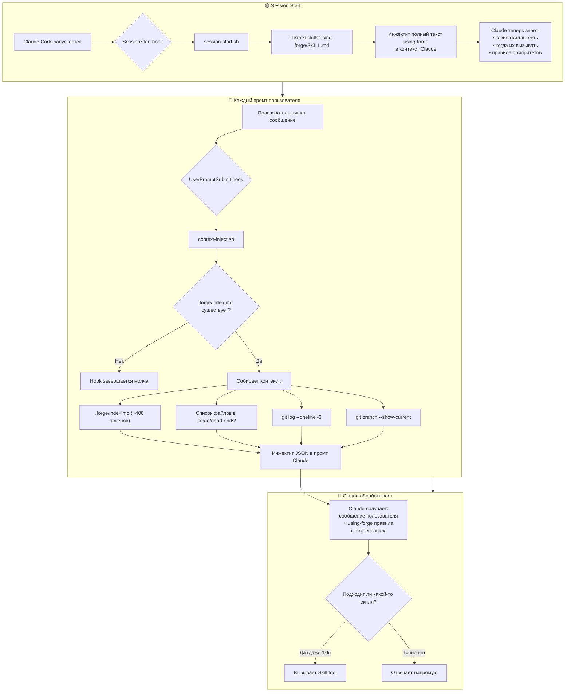
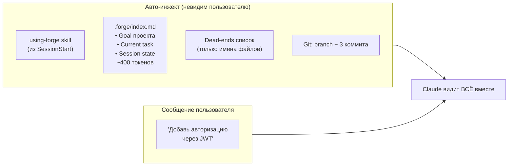
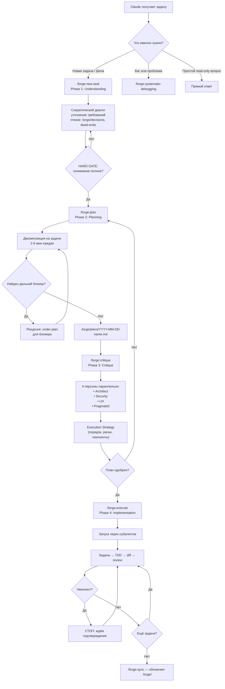
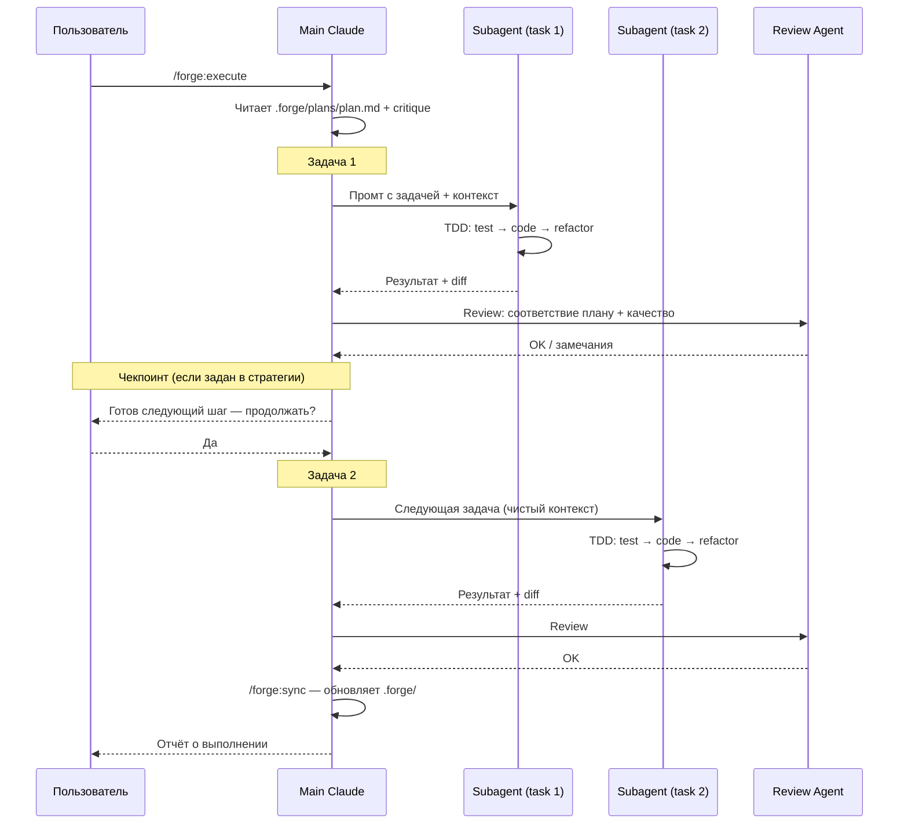
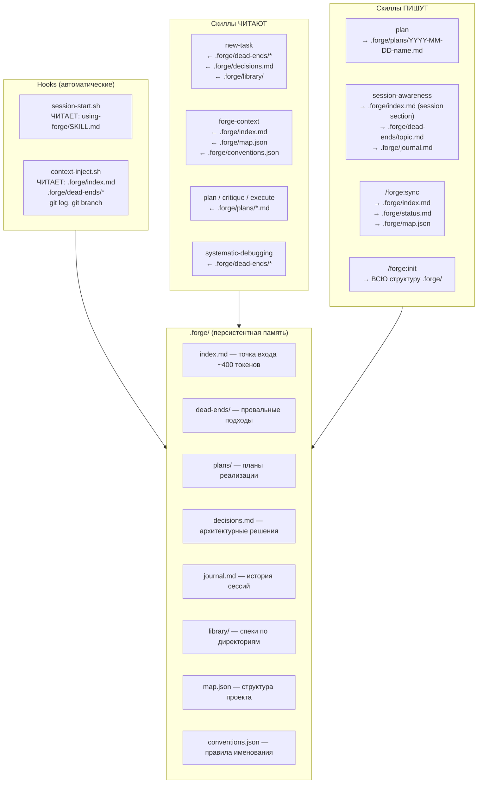

# Forge Plugin — Runtime Flow Visualization

> How the plugin works at runtime: hooks, context injection, skill invocation, and data flow.

---

## 1. Session Lifecycle (Big Picture)



---

## 2. Context Injection — What Claude Sees on Every Prompt



---

## 3. The 4-Phase Pipeline

Forge organizes любую новую задачу в строгий 4-фазный пайплайн. Каждая фаза — отдельная команда с явным переходом.



### Phase contracts

| Phase | Command | Outputs | Gate to next phase |
|-------|---------|---------|--------------------|
| 1. Understanding | `/forge:new-task` | Sharpened задача, открытые вопросы закрыты | Понимание подтверждено пользователем |
| 2. Planning | `/forge:plan` | `.forge/plans/*.md` с задачами 2-5 мин; рекурсия на блокеры | План полный, блокеры покрыты |
| 3. Critique | `/forge:critique` | Замечания от 4 персон + Execution Strategy | Critical issues закрыты, стратегия принята |
| 4. Implementation | `/forge:execute` | Код, тесты, обновлённый `.forge/` | Все задачи зелёные, чекпоинты пройдены |

---

## 4. Phase 4: Execute via Subagents



Ключевое:
- Каждая задача — отдельный субагент с чистым контекстом.
- Review — отдельный агент, независимый от исполнителя.
- На чекпоинтах из Execution Strategy main Claude останавливается и ждёт пользователя.

---

## 5. Data Flow — What Reads/Writes What



---

## 6. Token Economy

```
┌─────────────────────────────────────────────────────────┐
│                   БЕЗ FORGE                              │
│                                                          │
│  Claude читает исходники: 40,000+ токенов                │
│  Контекст теряется между сессиями                        │
│  Повторяет ошибки из прошлых попыток                     │
│  Каждая сессия — с нуля                                  │
└─────────────────────────────────────────────────────────┘

┌─────────────────────────────────────────────────────────┐
│                   С FORGE                                │
│                                                          │
│  SessionStart hook:                                      │
│    using-forge SKILL.md        ~800 токенов (один раз)   │
│                                                          │
│  Каждый промт (context-inject):                          │
│    .forge/index.md              ~400 токенов              │
│    dead-ends список             ~50 токенов              │
│    git log + branch             ~30 токенов              │
│    ─────────────────────────────────────                  │
│    ИТОГО за промт:             ~480 токенов              │
│                                                          │
│  По запросу (Skill tool):                                │
│    new-task SKILL.md           ~500 токенов              │
│    plan / critique / execute   ~400 токенов каждый       │
│    другие скиллы               ~300-600 токенов          │
│                                                          │
│  Результат: 480 вместо 40,000+ на каждый промт           │
│  Экономия: ~98.8% токенов                                │
└─────────────────────────────────────────────────────────┘
```

---

## 7. Timeline — Typical Development Session

```
Время   Событие                              Контекст Claude
──────  ─────────────────────────────────     ─────────────────────────
t=0     Claude Code запускается               пусто
        ↓ SessionStart hook                   + using-forge (~800 tok)

t=1     User: "хочу добавить JWT авторизацию"
        ↓ UserPromptSubmit hook               + .forge/index.md + dead-ends + git
        ↓ Claude → /forge:new-task            Phase 1: Understanding
        ↓ Сократический диалог                ...уточняет требования...

t=4     User подтверждает понимание
        ↓ Claude → /forge:plan                Phase 2: Planning
        ↓ Декомпозиция; рекурсия на блокер    план в .forge/plans/

t=7     План готов
        ↓ Claude → /forge:critique            Phase 3: Critique
        ↓ 4 персоны параллельно               замечания + Execution Strategy
        ↓ User одобряет стратегию

t=9     User: "выполняй"
        ↓ Claude → /forge:execute             Phase 4: Implementation
        ↓ Задача 1: TDD cycle                 subagent с чистым контекстом
        ↓ Review → OK
        ↓ Чекпоинт → стоп → user "go"
        ↓ Задача 2: TDD cycle                 новый subagent
        ↓ Review → OK
        ...

t=15    Все задачи выполнены
        ↓ Claude → /forge:sync                обновляет .forge/index.md
        ↓ session-awareness                   пишет в journal.md
        ↓ Claude: "готово, запусти /forge:validate"

t=16    User: /forge:validate
        ↓ Проверяет код vs план vs docs       read-only аудит
        ↓ Claude: "всё соответствует плану"

t=17    User: "мержим"
        ↓ finishing-a-development-branch       тесты → merge/PR
```
