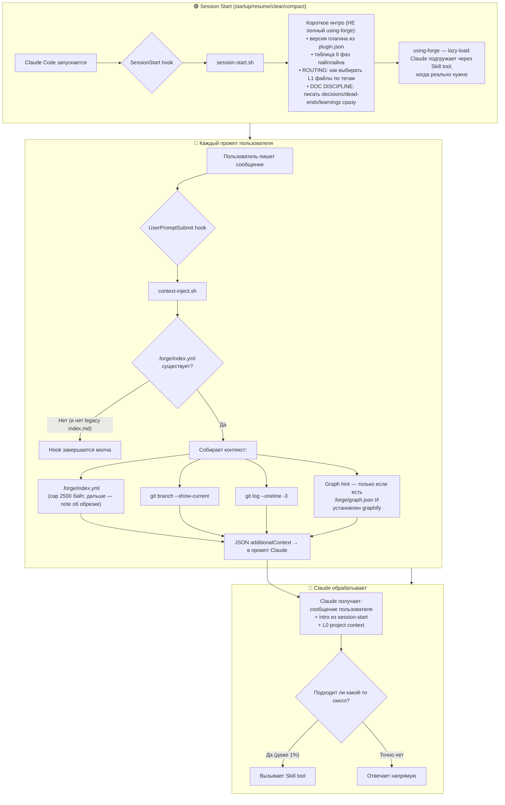
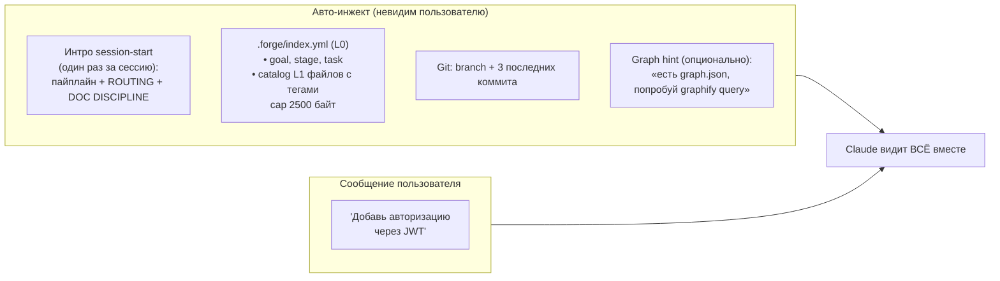
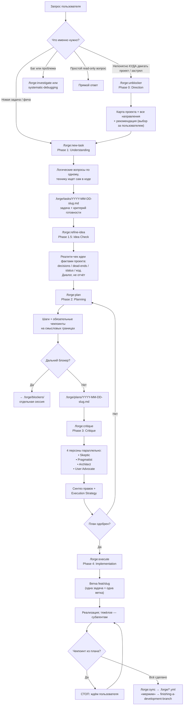
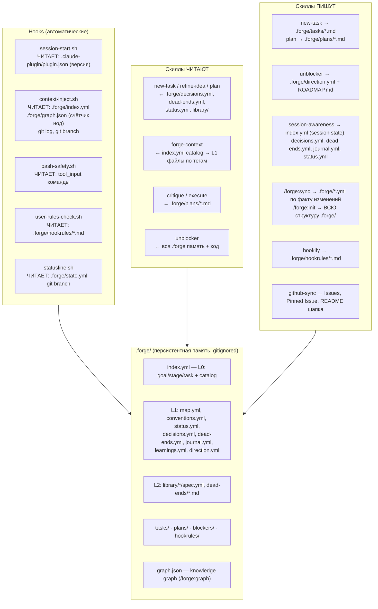

# Forge Plugin — Runtime Flow

> How the plugin works at runtime: hooks, context injection, skill invocation, and data flow.
> Источник правды — код в `hooks/` (`hooks.json` + `*.sh`). Здесь — архитектура без привязки к номерам строк.

---

## 0. Зарегистрированные хуки (hooks.json)

| Событие | Matcher | Скрипт / команда | Что делает |
|---------|---------|------------------|------------|
| `SessionStart` | `startup\|resume\|clear\|compact` | `session-start.sh` | Короткое интро: версия, пайплайн, ROUTING + DOC DISCIPLINE |
| `UserPromptSubmit` | — (каждый промпт) | `context-inject.sh` | Инжектит L0 контекст: index.yml + branch + git log + graph hint |
| `PreToolUse` | `Bash` | `bash-safety.sh` | Блокирует опасные bash-команды до выполнения |
| `PreToolUse` | `Bash\|Edit\|Write\|NotebookEdit` | `user-rules-check.sh` | Применяет пользовательские правила из `.forge/hookrules/*.md` |
| `Stop` | — | inline-команда | Случайный mp3 из `sounds/stop/` (async) |
| `PermissionRequest` | — | inline-команда | Случайный mp3 из `sounds/permission/` (async) |

Отдельно (НЕ в hooks.json): `statusline.sh` — механизм statusline Claude Code, подключается через `~/.claude/settings.json` пользователя.

---

## 1. Session Lifecycle (Big Picture)



Legacy: если вместо `index.yml` найден старый `.forge/index.md` — он инжектится целиком (fallback, новый формат приоритетнее).

---

## 2. Context Injection — What Claude Sees on Every Prompt



Правила STYLE в хуках больше не живут — они в нативном Output Style `output-styles/forge-concise.md` (auto-activated при включении плагина). ROUTING и DOC DISCIPLINE инжектятся один раз в session-start, а не на каждый промпт.

---

## 3. Guard Hooks — PreToolUse

### bash-safety.sh (matcher: Bash)

Парсит `tool_input.command` из JSON (через python3) и блокирует опасные категории паттернов **до выполнения**:

- `rm -rf` на критические пути (`/`, `~`, `$HOME`)
- `git push --force` в main/master
- `git reset --hard` к старому коммиту
- `dd` на блочные устройства
- `chmod 777` на системные каталоги
- удаление `.env` / credentials / ключей
- `curl | bash` — запуск скриптов из интернета

Контракт: exit 0 — разрешить; exit 2 — заблокировать, причина уходит Claude через stderr.

### user-rules-check.sh (matcher: Bash|Edit|Write|NotebookEdit)

Применяет **пользовательские** правила из `.forge/hookrules/*.md` (создаются скиллом `/forge:hookify`). Каждое правило — markdown с frontmatter:

```yaml
matcher: Bash|Edit|Write   # на каких инструментах действует
action: block | warn       # block = exit 2, warn = JSON permissionDecision allow + reason
pattern: 'regex'           # что искать в команде/контенте
message: "..."             # объяснение Claude, почему сработало
```

Правила читаются заново на каждый tool use — рестарт сессии не нужен. Нет `.forge/hookrules/` — хук молча пропускает.

---

## 4. The 6-Phase Pipeline (0 → 1 → 1.5 → 2 → 3 → 4)

Хуки пайплайн не ведут — его ведут скиллы/команды с auto-handoff (после «ОК» пользователя Claude сам инвокает следующую фазу).



### Phase contracts

| Phase | Command | Outputs | Gate to next phase |
|-------|---------|---------|--------------------|
| 0. Direction | `/forge:unblocker` | `direction.yml` + `ROADMAP.md`, первый шаг → new-task | Пользователь выбрал направление |
| 1. Understanding | `/forge:new-task` | `.forge/tasks/*.md`: задача + критерий готовности | Задача подтверждена пользователем |
| 1.5. Idea Check | `/forge:refine-idea` | Доработанный task-файл (опц. `## Доработано на разборе`) | Идея выдержала реалити-чек |
| 2. Planning | `/forge:plan` | `.forge/plans/*.md`: шаги + чекпоинты | План полный, блокеры покрыты |
| 3. Critique | `/forge:critique` | Правки в плане + Execution Strategy | Critical issues закрыты |
| 4. Implementation | `/forge:execute` | Код, тесты, обновлённый `.forge/` | Чекпоинты пройдены, критерий готовности проверен |

### GitHub Sync (опционально)

При `github_sync: true` в `.forge/index.yml` фазы зеркалятся на GitHub через скилл `github-sync` (`skills/github-sync/sync.sh`):
- `/forge:new-task` → Issue с задачей и критерием готовности
- `/forge:plan` → дочерние Sub-issues на шаги плана
- Pinned Issue — карта проекта (задачи по приоритетам/milestones) + авто-шапка README
- `/forge:roadmap` — управление картой целей на человеческом языке

Runtime-артефакты в проекте пользователя (gitignored): `.forge/.github-pinned-id`, `.forge/.github-issue-<slug>`, `.forge/.github-substeps-<slug>`, `.forge/.github-bootstrapped`.

---

## 5. Data Flow — What Reads/Writes What



---

## 6. Token Economy

```
┌─────────────────────────────────────────────────────────┐
│                   БЕЗ FORGE                              │
│                                                          │
│  Claude читает исходники: 40,000+ токенов                │
│  Контекст теряется между сессиями                        │
│  Повторяет ошибки из прошлых попыток                     │
│  Каждая сессия — с нуля                                  │
└─────────────────────────────────────────────────────────┘

┌─────────────────────────────────────────────────────────┐
│                   С FORGE                                │
│                                                          │
│  SessionStart hook (один раз):                           │
│    короткое интро + ROUTING + DOC DISCIPLINE             │
│    (НЕ полный using-forge — тот lazy-load)               │
│                                                          │
│  Каждый промпт (context-inject):                         │
│    .forge/index.yml (cap 2500 байт) + branch             │
│    + git log -3 + graph hint                             │
│    — порядка нескольких сотен токенов на промпт          │
│                                                          │
│  По запросу (Skill tool):                                │
│    SKILL.md конкретного скилла — только когда нужен      │
│    L1/L2 файлы .forge — только по тегам каталога         │
│                                                          │
│  Результат: сотни токенов вместо 40,000+ на промпт       │
└─────────────────────────────────────────────────────────┘
```

---

## 7. Timeline — Typical Development Session

```
Время   Событие                              Контекст Claude
──────  ─────────────────────────────────     ─────────────────────────
t=0     Claude Code запускается               пусто
        ↓ SessionStart hook                   + интро (фазы, ROUTING, DOC DISCIPLINE)

t=1     User: "хочу добавить JWT авторизацию"
        ↓ UserPromptSubmit hook               + index.yml + branch + git log
        ↓ Claude → /forge:new-task            Phase 1: Understanding
        ↓ Логические вопросы по одному        технику ищет сам в коде

t=3     Задача + критерий готовности записаны
        ↓ Claude → /forge:refine-idea         Phase 1.5: Idea Check
        ↓ Реалити-чек фактами проекта         та ли проблема? нет ли проще?

t=5     Идея выдержала разбор
        ↓ Claude → /forge:plan                Phase 2: Planning
        ↓ Шаги + чекпоинты                    план в .forge/plans/

t=7     План готов
        ↓ Claude → /forge:critique            Phase 3: Critique
        ↓ Skeptic/Pragmatist/Architect/       правки + Execution Strategy
          User Advocate параллельно
        ↓ User одобряет (если контекст
          тяжёлый — рекомендация: новый чат)

t=9     User: "выполняй"
        ↓ Claude → /forge:execute             Phase 4: Implementation
        ↓ Ветка feat/<slug>                   одна задача = одна ветка
        ↓ Тяжёлое — субагентам                чтение файлов, тесты, логи
        ↓ Чекпоинт из плана → стоп → "go"
        ...

t=15    Все шаги выполнены
        ↓ Claude → /forge:sync                обновляет .forge/*.yml
        ↓ session-awareness                   пишет journal.yml

t=16    User: /forge:validate
        ↓ Проверяет код vs план vs docs       read-only аудит

t=17    User: "мержим"
        ↓ finishing-a-development-branch       тесты → merge в master → ветка удалена
```
