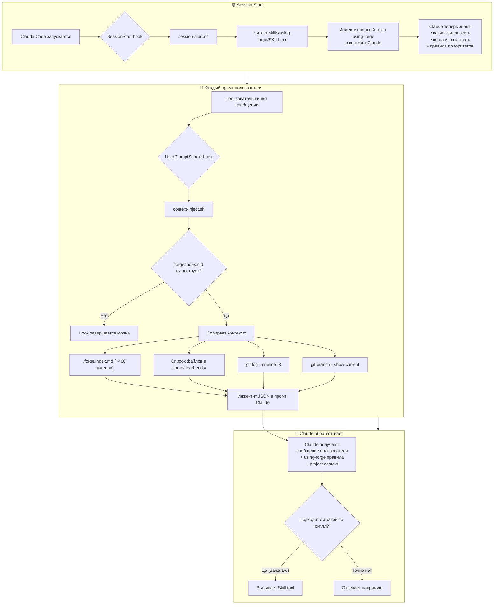
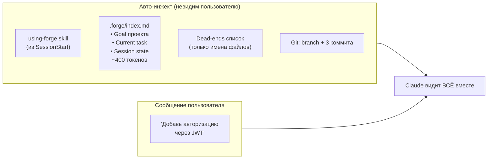
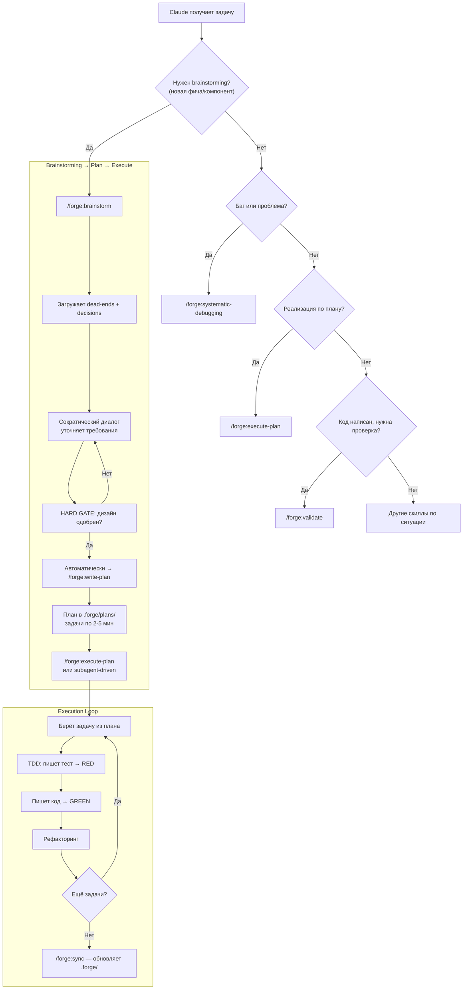
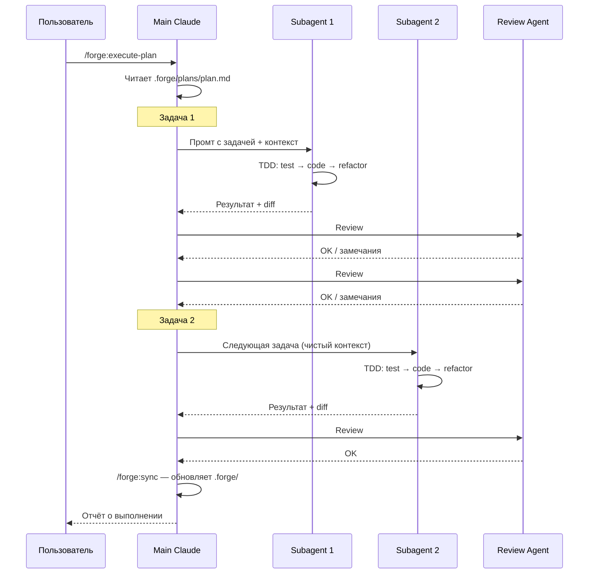
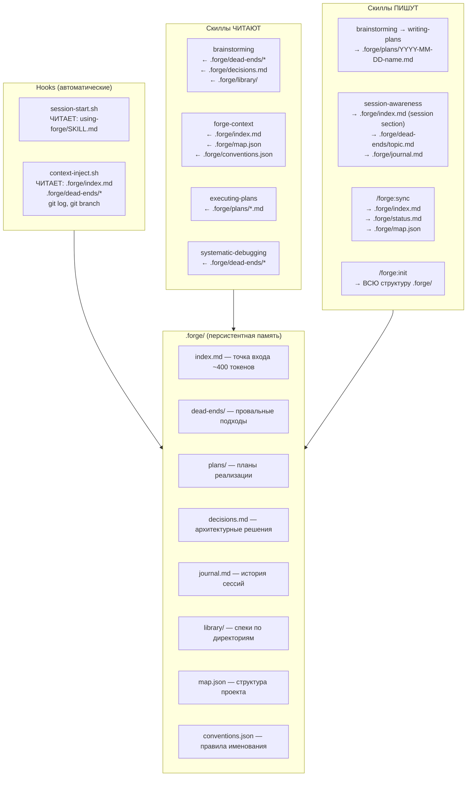

# Forge Plugin — Runtime Flow Visualization

> How the plugin works at runtime: hooks, context injection, skill invocation, and data flow.

---

## 1. Session Lifecycle (Big Picture)



---

## 2. Context Injection — What Claude Sees on Every Prompt



---

## 3. Skill Invocation Flow



---

## 4. Subagent-Driven Development — Detail



---

## 5. Data Flow — What Reads/Writes What



---

## 6. Token Economy

```
┌─────────────────────────────────────────────────────────┐
│                   БЕЗ FORGE                              │
│                                                          │
│  Claude читает исходники: 40,000+ токенов                │
│  Контекст теряется между сессиями                        │
│  Повторяет ошибки из прошлых попыток                     │
│  Каждая сессия — с нуля                                  │
└─────────────────────────────────────────────────────────┘

┌─────────────────────────────────────────────────────────┐
│                   С FORGE                                │
│                                                          │
│  SessionStart hook:                                      │
│    using-forge SKILL.md        ~800 токенов (один раз)   │
│                                                          │
│  Каждый промт (context-inject):                          │
│    .forge/index.md              ~400 токенов              │
│    dead-ends список             ~50 токенов              │
│    git log + branch             ~30 токенов              │
│    ─────────────────────────────────────                  │
│    ИТОГО за промт:             ~480 токенов              │
│                                                          │
│  По запросу (Skill tool):                                │
│    brainstorming SKILL.md      ~500 токенов              │
│    TDD SKILL.md                ~400 токенов              │
│    другие скиллы               ~300-600 токенов          │
│                                                          │
│  Результат: 480 вместо 40,000+ на каждый промт           │
│  Экономия: ~98.8% токенов                                │
└─────────────────────────────────────────────────────────┘
```

---

## 7. Timeline — Typical Development Session

```
Время   Событие                              Контекст Claude
──────  ─────────────────────────────────     ─────────────────────────
t=0     Claude Code запускается               пусто
        ↓ SessionStart hook                   + using-forge (~800 tok)

t=1     User: "хочу добавить JWT авторизацию"
        ↓ UserPromptSubmit hook               + .forge/index.md + dead-ends + git
        ↓ Claude: подходит brainstorming      + brainstorming skill
        ↓ Skill читает dead-ends, decisions   + контекст проекта
        ↓ Claude задаёт вопросы               ...уточняет требования...

t=5     User одобряет дизайн
        ↓ Claude → writing-plans skill        + writing-plans skill
        ↓ Пишет план → .forge/plans/           .forge/ обновлён

t=6     User: "выполняй"
        ↓ UserPromptSubmit hook               + обновлённый index.md
        ↓ Claude → executing-plans skill      + executing-plans skill
        ↓ Задача 1: TDD cycle                 subagent с чистым контекстом
        ↓ Review → OK
        ↓ Задача 2: TDD cycle                 новый subagent
        ↓ Review → OK
        ...

t=15    Все задачи выполнены
        ↓ Claude → /forge:sync                обновляет .forge/index.md
        ↓ session-awareness                   пишет в journal.md
        ↓ Claude: "готово, запусти /forge:validate"

t=16    User: /forge:validate
        ↓ Проверяет код vs план vs docs       read-only аудит
        ↓ Claude: "всё соответствует плану"

t=17    User: "мержим"
        ↓ finishing-a-development-branch       тесты → merge/PR
```
