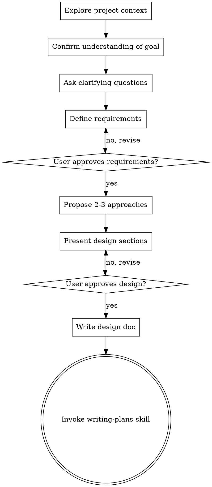

# Brainstorming Ideas Into Designs

## Overview

Help turn ideas into fully formed designs and specs through natural collaborative dialogue.

Start by understanding the current project context, then ask questions one at a time to refine the idea. Once you understand what you're building, present the design and get user approval.

<HARD-GATE>
Do NOT invoke any implementation skill, write any code, scaffold any project, or take any implementation action until you have presented a design and the user has approved it. This applies to EVERY project regardless of perceived simplicity.
</HARD-GATE>

<FORGE-GATE>
You MUST read docs/library/ spec.json files BEFORE exploring the project in any other way. If you find yourself running `find`, `ls`, `tree`, or reading source code files before reading docs/library/ — you are violating this gate. STOP and read docs/library/ first.

You MUST generate and get approval for requirements BEFORE proposing any design approaches. If you find yourself proposing architecture before requirements are approved — STOP.
</FORGE-GATE>

## Anti-Pattern: "This Is Too Simple To Need A Design"

Every project goes through this process. A todo list, a single-function utility, a config change — all of them. "Simple" projects are where unexamined assumptions cause the most wasted work. The design can be short (a few sentences for truly simple projects), but you MUST present it and get approval.

## Checklist

You MUST create a task for each of these items and complete them in order:

1. **Load FORGE context (MANDATORY FIRST STEP)** — Before doing ANYTHING else, read these files in this exact order:
   - `docs/map.json` — project structure and red zones
   - `docs/conventions.json` — project rules
   - `docs/state.json` — current state and pending tasks
   - ALL `docs/library/*/spec.json` files — complete project knowledge

   DO NOT read source code. DO NOT scan the filesystem. DO NOT read .kiro/, .claude/, or any other config directories. Everything you need to know about the project is in docs/library/. If docs/map.json does not exist, tell the user to run /forge:init first and STOP.

2. **Confirm understanding of goal** — Restate what you believe the user wants to build and ask for confirmation before proceeding
3. **Ask clarifying questions** — one at a time, understand purpose/constraints/success criteria
3.5. **Define requirements** — Based on the clarifying questions, generate a numbered list of requirements. Each requirement has:
   - **ID** (R1, R2, R3...)
   - **Description** — what must be true when this feature is done
   - **Acceptance criteria** — specific, testable conditions (not vague "should work well")
   - **Priority** — must-have / nice-to-have

   Format:
   ```
   Requirements

   Must-Have

   R1: [description]
   AC: [specific testable condition]

   R2: [description]
   AC: [specific testable condition]

   Nice-to-Have

   R5: [description]
   AC: [specific testable condition]
   ```

   Present requirements to user and get explicit approval: "Эти requirements верны? Что добавить/убрать?"

   DO NOT proceed to design (step 4) until requirements are approved.

4. **Propose 2-3 approaches** — with trade-offs and your recommendation
5. **Present design** — in sections scaled to their complexity, get user approval after each section
6. **Write design doc** — save to `docs/plans/YYYY-MM-DD-<topic>-design.md` and commit. Design doc MUST include Requirements section at the beginning (copy approved requirements from step 3.5)
7. **Transition to implementation** — invoke writing-plans skill to create implementation plan

## Process Flow



**The terminal state is invoking writing-plans.** Do NOT invoke frontend-design, mcp-builder, or any other implementation skill. The ONLY skill you invoke after brainstorming is writing-plans.

## The Process

**Understanding the idea:**
- Check out the current project state first (files, docs, recent commits)
- Ask questions one at a time to refine the idea
- Prefer multiple choice questions when possible, but open-ended is fine too
- Only one question per message - if a topic needs more exploration, break it into multiple questions
- Focus on understanding: purpose, constraints, success criteria

**Defining requirements:**
- After clarifying questions, synthesize answers into concrete requirements
- Each requirement must be:
  - **Specific** — not vague ("fast", "user-friendly"), but measurable ("respond in <200ms", "3 clicks max")
  - **Testable** — you can write a test to verify it's met
  - **Prioritized** — must-have vs nice-to-have
- Acceptance criteria must be objective: "When X happens, Y should be true"
- Example of good requirement:
  ```
  R1: Cache API responses to reduce backend load
  AC: 95% of requests to /api/indicators/* return cached data when called within 5 minutes
  Priority: must-have
  ```
- Example of bad requirement (too vague):
  ```
  R1: Make API fast
  AC: Should work well
  ```
- Present ALL requirements to user and get explicit approval before moving to design
- If user suggests changes, revise requirements and get approval again

**Exploring approaches:**
- Propose 2-3 different approaches with trade-offs
- Present options conversationally with your recommendation and reasoning
- Lead with your recommended option and explain why

**Presenting the design:**
- Before presenting, verify: Does this touch red zones from map.json? Does it conflict with conventions.json? Are external dependencies specified in library/*/spec.json up to date?
- Once you believe you understand what you're building, present the design
- Scale each section to its complexity: a few sentences if straightforward, up to 200-300 words if nuanced
- Ask after each section whether it looks right so far
- Cover: architecture, components, data flow, error handling, testing
- Be ready to go back and clarify if something doesn't make sense

## After the Design

**Documentation:**
- Write the validated design to `docs/plans/YYYY-MM-DD-<topic>-design.md`
- Design document structure:
  1. **Requirements** section (copy approved requirements from step 3.5)
  2. **Architecture** section (system design, components)
  3. **Data Flow** section (how data moves through the system)
  4. **Error Handling** section (how failures are handled)
  5. **Testing** section (test strategy)
- Use elements-of-style:writing-clearly-and-concisely skill if available
- Commit the design document to git

**Implementation:**
- If the design doc exceeds 150 lines, split it into separate feature docs before proceeding
- Invoke the writing-plans skill to create a detailed implementation plan
- Do NOT invoke any other skill. writing-plans is the next step.

## Key Principles

- **One question at a time** - Don't overwhelm with multiple questions
- **Multiple choice preferred** - Easier to answer than open-ended when possible
- **YAGNI ruthlessly** - Remove unnecessary features from all designs
- **Explore alternatives** - Always propose 2-3 approaches before settling
- **Incremental validation** - Present design, get approval before moving on
- **Be flexible** - Go back and clarify when something doesn't make sense
