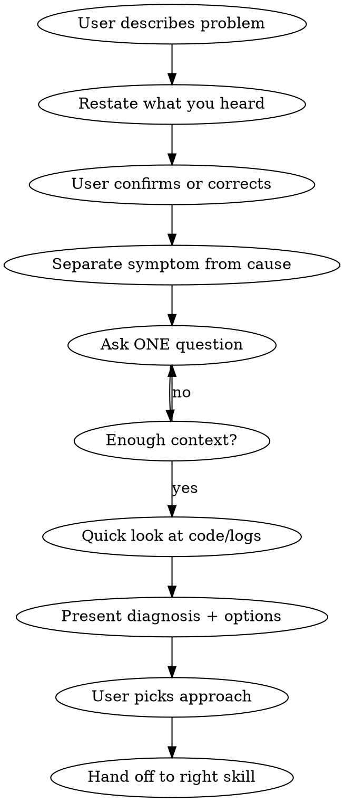

# Problem Investigation

Understand the problem before touching the code. This skill exists because Claude's default instinct — jumping straight to a fix — is the single biggest source of wasted time. When you see an error and immediately propose a solution, three things go wrong: you fix the symptom instead of the cause, you miss context the user already has, and you burn trust when the fix doesn't work.

The goal here is a shared understanding: what's actually happening, why, and what to do about it. Not a fix — an understanding.

## How it works



### Step 1: Listen and restate

Let the user finish. Then restate the problem in your own words — "Если я правильно понял, проблема в том что..." This does two things: it confirms you understood, and it forces you to articulate the problem before trying to solve it. If you can't restate it clearly, you don't understand it yet.

### Step 2: Separate symptom from cause

What the user sees and what's actually broken are usually different things.

Ask two questions:
- "Что ты ожидал?"
- "Что произошло вместо этого?"

The gap between expected and actual behavior is where the real problem lives.

**Example:**
- Symptom: "Страница грузится 10 секунд"
- Expected: "Должна за 1-2 секунды"
- Real problem could be: N+1 queries, missing index, unoptimized image, slow third-party API

Don't guess which one — investigate.

### Step 3: Gather context through questions

Ask **one question at a time**. This matters because dumping 5 questions at once overwhelms the user and you get shallow answers. One focused question gets you a real answer with details you wouldn't have thought to ask about.

Good questions to draw from (pick the most relevant, don't ask all):
- Когда это началось?
- Это воспроизводится стабильно или иногда?
- Что менялось недавно? (деплой, обновление, рефакторинг)
- Это работало раньше?
- Кого затрагивает — всех или конкретных пользователей?

### Step 4: Quick investigation

Now — and only now — look at the code. The goal is to form a hypothesis, not to fix anything.

If multiple areas might be involved, dispatch subagents in parallel:
- One reads error logs / stack traces
- One checks recent git changes in the affected area
- One reads the relevant code to understand current behavior

Read to understand, not to edit.

### Step 5: Present diagnosis

Structure your findings clearly:

```
## Диагноз

**Симптом:** [что пользователь видит]
**Вероятная причина:** [гипотеза с обоснованием]
**Доказательства:** [что вы нашли в коде/логах]
**Затронутые области:** [модули/файлы]

## Варианты

1. [Подход A] — [что делаем, плюсы, минусы, трудоёмкость]
2. [Подход B] — [что делаем, плюсы, минусы, трудоёмкость]

**Рекомендация:** [какой и почему]
```

Give a recommendation — don't just list options and ask "what do you think?" The user hired you for your judgment. But present it as a recommendation, not a decree.

### Step 6: Agree and hand off

Once the user picks an approach:
- Clear fix needed → transition to `forge:systematic-debugging`
- Design change needed → transition to `forge:brainstorming`
- Quick one-liner → just do it

For non-trivial problems, save the investigation to `.forge/plans/YYYY-MM-DD-investigate-<topic>.md` — it's useful context if the fix gets complicated later.

## Why this process matters

Without it, here's what happens: Claude sees "не работает", pattern-matches to a similar bug it's seen before, proposes a fix. The fix doesn't work because the actual problem is different. Now you've wasted time AND you've muddied the waters with a wrong change. Worse — sometimes the wrong fix appears to work but masks the real issue, which resurfaces later in a harder-to-debug form.

5 minutes of "let me understand what's happening" prevents hours of "why isn't this fix working?"

## Traps to watch for

**The obvious fix trap.** You see the error, you know what usually causes it, you want to just fix it. Resist. The same error message can have completely different root causes depending on context. Ask first.

**The solution dump trap.** Instead of investigating, you list 5 possible causes and say "try these." This puts the diagnostic burden on the user — which is exactly backwards. You have the tools to investigate; use them.

**The shallow analysis trap.** You read the error message but don't trace where the bad value came from. Surface-level analysis leads to surface-level fixes.

**The impatience trap.** The user seems rushed, so you skip questions and go straight to fixing. This is when investigation matters most — under pressure is when wrong fixes are most costly.

## Neighboring skills

This skill doesn't exist in isolation. Here's when to use what:

| Situation | Skill |
|-----------|-------|
| "Что-то не так, давай разберёмся" | **problem-investigation** (this) |
| "Знаю причину, нужно починить" | forge:systematic-debugging |
| "Хочу добавить фичу" | forge:brainstorming |
| "Застрял, не знаю что делать" | forge:project-unblocker |
