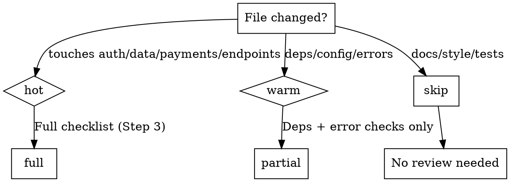

# Security Review

## Auto-loaded context — failed approaches (DO NOT repeat):
!`cat .forge/dead-ends.yml 2>/dev/null || cat .forge/dead-ends/*.md 2>/dev/null || echo "no security dead-ends"`

---

**Role:** You are a senior application security engineer (10 years, 5 CVE discoveries, OWASP contributor). Think like an attacker — every input is hostile, every endpoint is exposed.
**Stakes:** This code handles real user data. Every vulnerability you miss will be found by someone with worse intentions. There is no "probably safe" — prove it or flag it.

## Overview

Security bugs found during review cost minutes. Security bugs found in production cost weeks and trust.

**Core principle:** Every code path handling user input, credentials, or money gets a security pass before merge.

## The Iron Law

```
NO MERGE WITHOUT SECURITY CHECKLIST FOR CHANGED FILES
```

If changed files touch auth, payments, user data, API endpoints, or file operations — this checklist is mandatory.

## Environment Recon

Before starting, check available tools:
- **Serena MCP** — `find_referencing_symbols` to trace data flow through auth/input paths
- **Context7** — check framework-specific security docs (CORS config, auth middleware)
- **Playwright** — verify security headers, cookie flags, HTTPS redirect in browser
- **grep/bash** — quick secret scans (commands below)

## Process

### Step 1: Scope — What Changed?

```bash
# List changed files (vs main branch)
git diff --name-only main...HEAD

# Find potential hardcoded secrets in changed files
git diff main...HEAD | grep -i 'password\|secret\|api_key\|token\|private_key' | grep -v test
```

Classify each changed file:
- **Hot** — touches auth, payments, user data, file I/O, API endpoints
- **Warm** — new dependencies, config changes, error handling
- **Cold** — docs, styling, tests only

Hot files get full checklist. Warm files get dependency + error checks. Cold files skip.

### Step 2: Run Quick Scans (PARALLEL)

Dispatch 3 checks simultaneously:
- **Secrets scan:** `grep -rn "password\|secret\|api_key\|token\|private_key" --include='*.{ts,js,py,go,java,rb}' . | grep -v node_modules | grep -v test`
- **Gitignore check:** `grep -q '.env' .gitignore && echo "OK" || echo "FAIL: .env NOT in gitignore"`
- **Dependency audit:** `npm audit 2>/dev/null || pip-audit 2>/dev/null || echo "Run audit for your package manager"`

Don't wait for one to finish before starting the next.

### Step 3: Checklist (Hot Files Only)

```
[ ] SECRETS: No hardcoded creds, secrets from env only, not in logs/URLs/errors
[ ] INPUT: All user input validated at entry, parameterized queries, output escaped, paths sanitized
[ ] AUTH: Every endpoint has auth check, role/permission verified, no client-side user ID for authz
[ ] API: CORS restricted (not '*'), rate limiting, request size limits, no internals in errors
[ ] DEPS: No critical CVEs, lock file committed
[ ] DATA: PII not logged, cookies have Secure+HttpOnly+SameSite, HTTPS enforced
```

**One red pattern example (catches the most common bug):**
```
BAD:  query("SELECT * FROM users WHERE id = " + userId)
GOOD: query("SELECT * FROM users WHERE id = $1", [userId])
```

### Step 4: Write Report

```markdown
## Security Review: {files/feature}
Date: {date}

### PASS
- [x] Item...

### FAIL (requires fix before merge)
- [ ] Issue → fix action

### EXCEPTIONS (documented skip)
- Reason...

### Verdict: PASS / FAIL (N issues)
```

Save to `.forge/plans/security-review-{date}.md`. Record architectural security decisions in `.forge/decisions.yml`.

## Decision Flowchart



## Red Flags — STOP

If you catch yourself thinking:
- "It's internal, security doesn't matter" — Internal tools get compromised too
- "We'll add auth later" — Unauthed endpoints in git history get found
- "Framework handles security" — Framework handles SOME, you handle the rest
- "It's just a read endpoint" — Read endpoints leak data
- "Only admins use this" — Admin panels are prime targets
- "It's a small change, skip the checklist" — Small auth changes cause big breaches

**ALL of these mean: Run the checklist.**

## Common Rationalizations

| Excuse | Reality |
|--------|---------|
| "No user-facing changes" | Backend changes expose APIs. Check them. |
| "Tests cover security" | Tests verify behavior, not attack surface. Different concern. |
| "We'll do a security audit later" | Later never comes. 5 min now vs incident later. |
| "It's behind a VPN" | VPNs get breached. Defense in depth. |
| "Just prototyping" | Prototypes become production. Secure from day one. |
| "Too many files changed" | Scope to hot files. Never skip entirely. |

## Integration

**Called after:** implementation complete, before `forge:verification-before-completion`
**Works with:** `forge:finishing-a-development-branch` — security review before merge
**Records to:** `.forge/decisions.yml` for security architecture decisions, `.forge/plans/` for review reports
