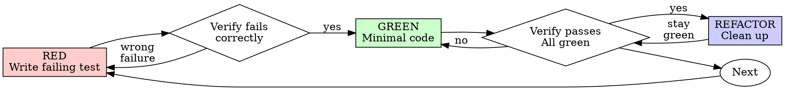

**Role:** Senior engineer, TDD evangelist. Tests come first, always.
**Stakes:** If you didn't watch the test fail, you don't know what it tests — only that it passes.

# Test-Driven Development (TDD)

## Overview

Write the test first. Watch it fail. Write minimal code to pass.

**Core principle:** If you didn't watch the test fail, you don't know if it tests the right thing.

## The Iron Law

```
NO PRODUCTION CODE WITHOUT A FAILING TEST FIRST
```

Wrote code before the test? Delete it. Implement fresh from tests. Don't keep "for reference" — you'll adapt it, which is testing-after.

## When to Use

**Always:** new features, bug fixes, refactoring, behavior changes.

**Exceptions (ask the user first):** throwaway prototypes, generated code, configuration files.

**Forge-plugin specific:** TDD applies to functional logic only. Skip for:
- Markdown configs, YAML, prompt templates
- HTML/CSS prototypes without behavior
- Skill descriptions, command files

Apply TDD when there's a function with input → output that can break.

Thinking "skip TDD just this once"? Stop. That's rationalization.

## DDD-Aware Testing

If the design has a Domain Model, see @references/ddd-testing.md for priorities (domain primitives, entity lifecycle, aggregate invariants, boundary rules).

## Goal-Driven Testing

Transform every request into a testable objective:
- "Add validation" → test for invalid input, make it pass
- "Fix the bug" → test reproducing it, then fix
- "Refactor X" → tests pass before AND after
- "Add feature Y" → test describing desired behavior

If you can't write a test, you don't understand the requirement. Clarify first.

## Red-Green-Refactor



### RED — Write Failing Test

One minimal test showing what should happen. One behavior, clear name, real code (no mocks unless unavoidable).

<Good>
```typescript
test('retries failed operations 3 times', async () => {
  let attempts = 0;
  const operation = () => {
    attempts++;
    if (attempts < 3) throw new Error('fail');
    return 'success';
  };
  const result = await retryOperation(operation);
  expect(result).toBe('success');
  expect(attempts).toBe(3);
});
```
Clear name, real behavior, one thing. (Bad: `test('retry works')` with `jest.fn().mockRejectedValueOnce(...)` — vague name, tests the mock not the code.)
</Good>

### Verify RED — Watch It Fail

**MANDATORY.** Run the test. Confirm:
- Test fails (not errors out)
- Failure message is what you expect
- Fails because feature missing (not typos)

Test passes? You're testing existing behavior — fix the test. Test errors? Fix and re-run until it fails correctly.

### GREEN — Minimal Code

Simplest code to pass. No extra features, no "improvements" to adjacent code.

```typescript
async function retryOperation<T>(fn: () => Promise<T>): Promise<T> {
  for (let i = 0; i < 3; i++) {
    try { return await fn(); }
    catch (e) { if (i === 2) throw e; }
  }
  throw new Error('unreachable');
}
```
Just enough to pass. (Bad: adding `options?: { maxRetries, backoff, onRetry }` — YAGNI.)

### Verify GREEN — Watch It Pass

**MANDATORY.** Run. Confirm:
- Test passes
- Other tests still pass
- Output pristine (no warnings/errors)

Test fails? Fix code, not test. Other tests fail? Fix now.

### REFACTOR — Clean Up

After green only: remove duplication, improve names, extract helpers. Keep tests green. Don't add behavior.

### Repeat

Next failing test for next feature.

## Good Tests

| Quality | Good | Bad |
|---------|------|-----|
| **Minimal** | One thing. "and" in name? Split it. | `test('validates email and domain and whitespace')` |
| **Clear** | Name describes behavior | `test('test1')` |
| **Shows intent** | Demonstrates desired API | Obscures what code should do |

## Why Tests-First, Not Tests-After

Tests written after code pass immediately — and passing immediately proves nothing. You might test the wrong thing, you never saw it catch a bug, and you're biased by what you already built (so you test what exists, not what's required). Test-first forces you to see the test fail and discover edge cases before implementing. It's also faster than debugging in production.

## Common Rationalizations

| Excuse | Reality |
|--------|---------|
| "Too simple to test" | Simple code breaks. Test takes 30 seconds. |
| "I'll test after" | Passing immediately proves nothing. |
| "Already manually tested" | Ad-hoc ≠ systematic. Can't re-run. |
| "Keep as reference" | You'll adapt it. Delete means delete. |
| "Test hard = design unclear" | Listen to the test. Hard to test = hard to use. |

## Red Flags — STOP and Start Over

- Code written before test
- Test passes immediately on first run
- Can't explain why test failed
- Rationalizing "just this once"
- "Keep as reference" or "adapt existing code"

**All of these mean: Delete code. Start over with TDD.**

## Example: Bug Fix

**Bug:** Empty email accepted

**RED**
```typescript
test('rejects empty email', async () => {
  const result = await submitForm({ email: '' });
  expect(result.error).toBe('Email required');
});
```

**Verify RED:** `FAIL: expected 'Email required', got undefined`

**GREEN**
```typescript
function submitForm(data: FormData) {
  if (!data.email?.trim()) return { error: 'Email required' };
  // ...
}
```

**Verify GREEN:** `PASS`

**REFACTOR:** extract validation for multiple fields if needed.

## Verification Checklist

Before marking work complete:

- [ ] Every new function/method has a test
- [ ] Watched each test fail before implementing
- [ ] Each test failed for expected reason
- [ ] Wrote minimal code to pass
- [ ] All tests pass, output pristine
- [ ] Tests use real code (mocks only if unavoidable)
- [ ] Edge cases and errors covered

Can't check all boxes? You skipped TDD. Start over.

## When Stuck

| Problem | Solution |
|---------|----------|
| Don't know how to test | Write wished-for API. Write assertion first. Ask the user. |
| Test too complicated | Design too complicated. Simplify interface. |
| Must mock everything | Code too coupled. Use dependency injection. |
| Test setup huge | Extract helpers. Still complex? Simplify design. |

## Debugging Integration

Bug found? Write a failing test reproducing it. Follow TDD cycle. Test proves fix and prevents regression. Never fix bugs without a test.

## Testing Anti-Patterns

When adding mocks or test utilities, read @testing-anti-patterns.md to avoid:
- Testing mock behavior instead of real behavior
- Adding test-only methods to production classes
- Mocking without understanding dependencies

## Final Rule

```
Production code → test exists and failed first
Otherwise → not TDD
```

No exceptions without the user's permission.
