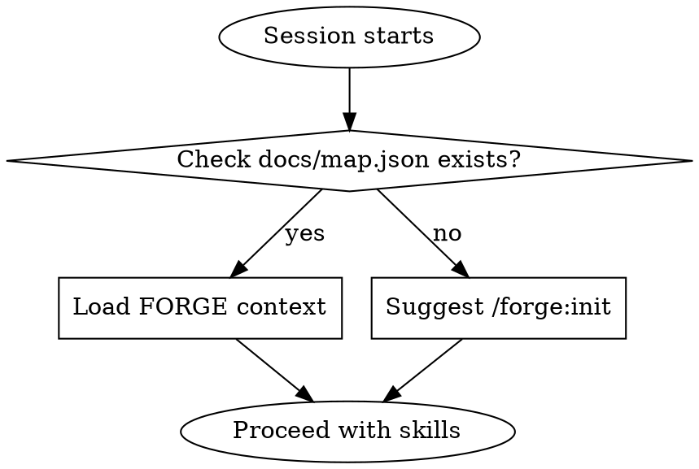

# FORGE Project Context

## Overview

Load complete project context from documentation files instead of reading source code.

**Core principle:** 2k tokens of structured documentation > 40k tokens of source code reading.

**Use when:** Project has `docs/map.json` (created by `/forge:init`).

## When to Use



**Always check at session start.** If docs/map.json exists, load context before doing anything else.

## The Process

### Step 1: Read map.json

```bash
cat docs/map.json
```

Understand:
- Project structure (which directories exist)
- File counts per directory
- Red zones (critical files requiring extra care)

Example:
```json
{
  "project": "trading-bot",
  "directories": {
    "indicators/": { "files": 5, "red_zone_files": 1 },
    "strategies/": { "files": 3, "red_zone_files": 2 },
    "utils/": { "files": 6, "red_zone_files": 0 }
  },
  "red_zones": [
    "indicators/rsi.py",
    "strategies/production_strategy.py"
  ]
}
```

**Now you know:** Project has 3 main directories, 14 total files, 3 are red zones.

### Step 2: Read conventions.json

```bash
cat docs/conventions.json
```

Understand:
- Language/framework
- Naming conventions (files, classes, functions, constants)
- Directory structure rules
- Common patterns for adding new features
- Past architectural decisions

Example:
```json
{
  "language": "python",
  "naming": {
    "files": "snake_case",
    "classes": "PascalCase",
    "functions": "snake_case"
  },
  "structure": {
    "indicators": "Each indicator is a pure function in its own file",
    "strategies": "Each strategy inherits BaseStrategy"
  },
  "patterns": {
    "new_indicator": "Create file in indicators/, add export to __init__.py, add test"
  },
  "decisions": {
    "pandas_not_polars": "Existing codebase uses pandas, migration not worth it"
  }
}
```

**Now you know:** How to write code that fits the project's style and patterns.

### Step 3: Read state.json

```bash
cat docs/state.json
```

Understand:
- Current task (what user is working on)
- Progress (how far along they are)
- Pending items (what's left to do)
- Recent changes (what was modified last session)

Example:
```json
{
  "current_task": "Add MACD indicator",
  "progress": "3/5 tasks done",
  "last_session": "2026-02-15",
  "last_session_summary": "Added MACD calculation, wrote tests",
  "pending": [
    "Connect MACD to RSI strategy",
    "Add backtest for MACD"
  ],
  "recent_changes": [
    "indicators/macd.py — new file",
    "tests/test_macd.py — new file"
  ]
}
```

**Now you know:** Where user left off, what's in progress, what comes next.

### Step 4: Context Loaded — Ready to Work

You now have complete project context:
- ✓ Structure (from map.json)
- ✓ Conventions (from conventions.json)
- ✓ Current state (from state.json)

**Do NOT read source files yet.** You have enough context to understand the project.

**When to read source:**
- Need details about specific file: read `docs/library/[folder]/spec.json` first
- spec.json insufficient: only then read the actual source file
- Implementing or modifying: read affected files directly

## Token Budget

Loading FORGE context vs reading source code:

| Approach | Tokens | Coverage |
|----------|--------|----------|
| Read map.json | ~300 | Structure + red zones |
| Read conventions.json | ~500 | Patterns + decisions |
| Read state.json | ~200 | Current work context |
| **Total FORGE** | **~1k** | **Complete project understanding** |
| | | |
| Read all source files | ~40k+ | Same understanding + unnecessary detail |

**20-40x token efficiency.** You get the same understanding for fraction of the cost.

## Detailed Context: library/ spec.json

When you need details about specific directory:

```bash
cat docs/library/indicators/spec.json
```

Example:
```json
{
  "purpose": "Technical analysis indicators — pure functions",
  "files": {
    "macd.py": {
      "intent": "Calculate MACD indicator (fast EMA - slow EMA + signal)",
      "inputs": ["df: DataFrame", "fast: int=12", "slow: int=26"],
      "outputs": "DataFrame with macd, signal, histogram columns",
      "depends_on": ["pandas"],
      "red_zone": false
    },
    "rsi.py": {
      "intent": "Calculate RSI using Wilder's smoothing method",
      "inputs": ["df: DataFrame", "period: int=14"],
      "outputs": "DataFrame with rsi column",
      "depends_on": ["pandas"],
      "red_zone": true,
      "red_zone_reason": "Production strategy depends on exact calculation"
    }
  }
}
```

**Now you know:** What each file does, its inputs/outputs, dependencies, red zone status.

**Still need source?** Read it. But most questions answered by spec.json.

## Red Flags

Stop and load FORGE context first when you think:

| Thought | Reality |
|---------|---------|
| "Let me explore the codebase" | Stop. Read docs/map.json first. |
| "I need to understand the project structure" | Stop. Read docs/map.json first. |
| "What files exist here?" | Stop. Read docs/map.json first. |
| "What's the naming convention?" | Stop. Read docs/conventions.json first. |
| "What was I working on?" | Stop. Read docs/state.json first. |
| "I should read some code to understand" | Stop. Read docs/library/[folder]/spec.json first. |

**FORGE documentation first. Source code second.**

## After Loading Context

Once context loaded:
1. Acknowledge current task from state.json
2. Check if work relates to red zones from map.json
3. Follow patterns from conventions.json
4. Proceed with relevant skill (brainstorming, executing-plans, etc.)

Example acknowledgment:
```
I've loaded your project context:

Project: trading-bot (Python)
Structure: 3 directories, 14 files
Red zones: 3 files (rsi.py, production_strategy.py, model.py)
Current task: Add MACD indicator (3/5 tasks done)
Pending: Connect MACD to RSI strategy, Add backtest

Ready to continue. What would you like to work on?
```

## Integration

**Called by:**
- **using-forge** skill (at session start if docs/map.json exists)

**Before using:**
- Project must have been initialized with `/forge:init`

**After using:**
- Suggest `/forge:sync` when user completes work

## Remember

- FORGE context = structured understanding (~1-2k tokens)
- Source code = raw details (~40k+ tokens)
- Load context first, read source only when needed
- map.json shows structure, conventions.json shows patterns, state.json shows progress
- spec.json answers "what does this file do?"
- Source code answers "how exactly does it work?"
- Most tasks need "what", not "how"
